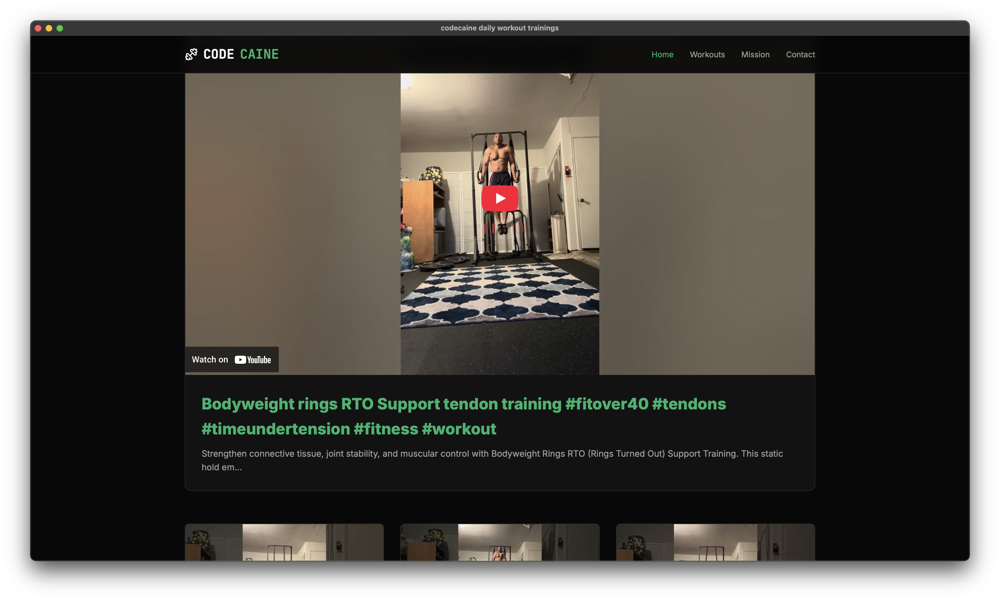
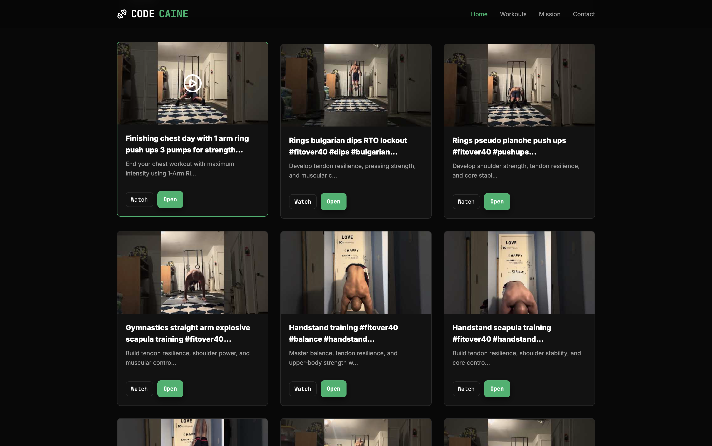

# codecaine_daily_workout_trainings

Neutralino.js desktop app — loads [CodeFreelance](https://www.codefreelance.net) as the main page.

## About

I'm 44 and into advanced fitness — I work out with a mix of calisthenics, gymnastics, mobility, and strength training.

## Playlists & Resources

- **The Elite Playbook — fitness advice from experts:** [The Elite Playbook (YouTube playlist)](https://www.youtube.com/playlist?list=PLuQI68PE-VaBxuZgPFSwR7DfynFNiQcJ3). This is where I learned much of my knowledge — a curated, 100% free playlist I maintain on YouTube.
- **Exercises ranking (every body part, worst → best):** [Exercises playlist](https://www.youtube.com/playlist?list=PLjLlxX-iKW8-ixSGe1AbMe1_YvKuoypRh). A playlist that demonstrates and ranks exercises for each body part from worst to best.
- **Life education — focus & productivity:** [Life education / focus playlist](https://www.youtube.com/watch?v=OyKIbaSk2s4&list=PLuQI68PE-VaAYdjqDdZbm5ONvS-We8w8c). Videos about life education and becoming more focused.
- **Body Mechanics (mobility & mechanics playlist):** [Body Mechanics playlist](https://www.youtube.com/playlist?list=PLDPMX3-25tVhhNIKiShOIHyGQTOH2kgxG). A playlist focused on body mechanics and movement quality.

## Screenshots




## Initial setup (first download)

After you clone or download the repository run the following once to download the Neutralino client and other required assets, then start the app:

```bash
neu update
neu run
````

## Run (development)

Requirements:

  - Neutralino CLI (`neu`) installed — see the [Neutralino.js docs](https://neutralino.js.org/).

From the project root you can start the app during development with:

```bash
neu run
```

Or run a packaged binary from `./bin/` (mac example):

```bash
./bin/neutralino-mac_universal
```

## Build & Release (create binaries)

To create standalone binaries for Linux, Windows, and macOS (including Apple Silicon/ARM), run the build command. This processes your resources and packages them with the Neutralino binaries.

**1. Build binaries:**
This creates the executables in the `dist/` folder.

```bash
neu build
```

**2. Build release (optional):**
To create a finalized `.zip` file for distribution, use the release flag. This is useful for sharing the app.

```bash
neu build --release
```

**Output location:**
After running the build, check the `./dist/` directory. You will typically find:

  - **macOS:** `dist/codecaine_daily_workout_trainings/codecaine_daily_workout_trainings-mac_universal`
  - **Linux:** `dist/codecaine_daily_workout_trainings/codecaine_daily_workout_trainings-linux_x64`
  - **Windows:** `dist/codecaine_daily_workout_trainings/codecaine_daily_workout_trainings-win_x64.exe`

**Testing the macOS binary:**
You can run the newly built Mac binary directly from your terminal:

```bash
# Adjust the path if your project name differs in neutralino.config.json
./dist/codecaine_daily_workout_trainings/codecaine_daily_workout_trainings-mac_universal
```

## Notes

  - The app is configured to open the external URL [https://www.codefreelance.net](https://www.codefreelance.net) on startup (`neutralino.config.json`).
  - A fallback `meta` refresh was added to `resources/index.html` so if the local page is served it redirects to the external site.
  - Cmd+Q on macOS has been wired to call `Neutralino.app.exit()` from `resources/js/main.js`.

If you want additional documentation or packaging instructions, tell me which platform to target.

## Install NeutralinoJS (bun / npm)

You can add the Neutralino.js client library to your project using `bun` or `npm`.

  - **With `bun` (recommended if you use Bun):**

<!-- end list -->

```bash
bun add neutralinojs
```

  - **With `npm`:**

<!-- end list -->

```bash
npm install neutralinojs --save
# or, to install globally (not usually necessary for apps):
npm install -g neutralinojs
```

Quick usage examples:

```js
neu create app_name
cd app_name
neu run
```
